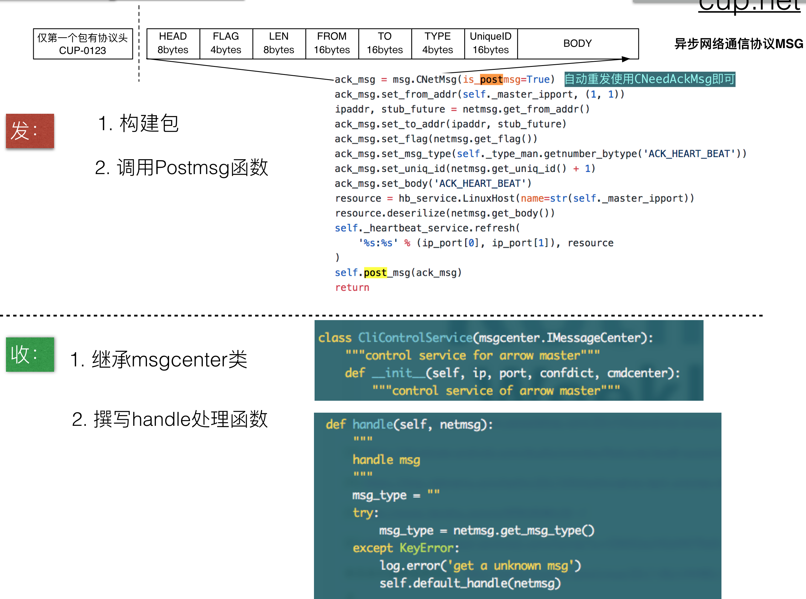
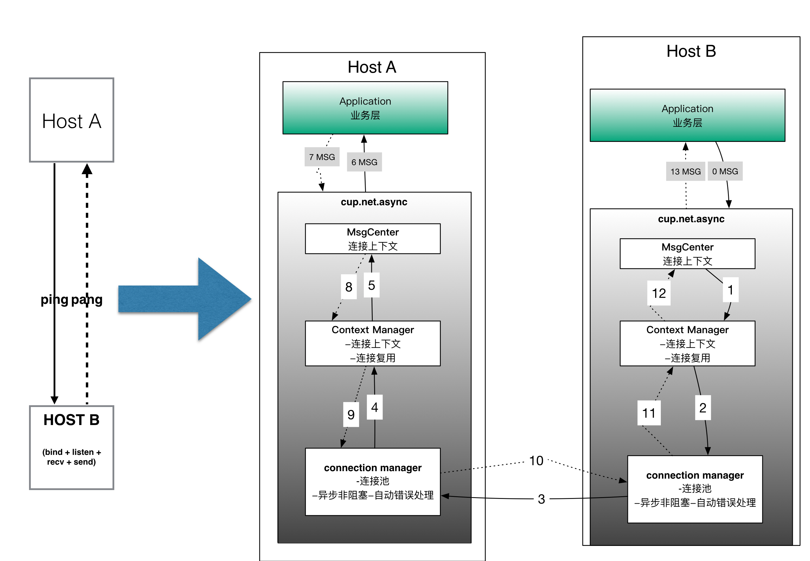

<!-- MDTOC maxdepth:6 firsth1:1 numbering:0 flatten:0 bullets:1 updateOnSave:1 -->

- [1. 从零开始构建网络通信](#1-从零开始构建网络通信)   
   - [1.1 网络链接管理](#11-网络链接管理)   
   - [1.2 网络信息结构化](#12-网络信息结构化)   
   - [1.3 信息收发控制](#13-信息收发控制)   
   - [1.4 网络异常处理](#14-网络异常处理)   
- [2. cup.net.async辅助下构建](#2-cupnetasync辅助下构建)   
   - [2.1 async内部通讯机制](#21-async内部通讯机制)   

<!-- /MDTOC -->


# 1. 从零开始构建网络通信

如果不依靠框架辅助, 从零开始构建一个client/server cs模型程序. 我们要思考并解决如下常见问题:
- 网络链接的管理
- 网络信息结构化
- 结构化信息收发
- 网络异常处理


## 1.1 网络链接管理

- 链接建立
- 链接销毁
- 链接异常处理

## 1.2 网络信息结构化

网络传输的信息结构化, 更多的是设计上的考量. 只有传输信息是结构化的, 才容易进行:
- 信息传输控制
  - 滑动窗口
  - 保障到达
- 信息错误识别
  - 识别网络抖动
  - 识别信息篡改/错误

## 1.3 信息收发控制
信息收发上, 除了基本的信息读写之外, 真实的线上服务需要考虑信息保序到达, 重复处理, 故障处理重发等等
- 信息读写
- 信息保序
- 信息保障到达
- 信息重复处理

## 1.4 网络异常处理
网络异常时, 要能及时销毁链接防止过多的socket占用Opened FILE Handle. 如果仅是网络抖动的问题,
还需要可以及时自动重连.
- 链接异常销毁
- 链接重连
- 链接idle处理

# 2. cup.net.async辅助下构建

在CUP的辅助下, 你可以不用考虑底层的网络链接处理, 专注上层的业务逻辑:
一个简单的收发示例如下图:

- 网络双向传输, 构建收和发即可
  - 收继承async的msgcenter.IMessageCenter并实现handle函数即可
  - 发直接调用msg module的接口, 创建结构化msg, 调用post_msg接口即可完成发送
- 底层的网络处理托管给cup.net.async即可, 会帮你处理好网络链接管理

如果你对其中的通讯模型感兴趣, 请继续往下看:

## 2.1 async内部通讯机制
简单来说, cup.net.async是把
- 原来ping<->pang模型，转换成了异步的cup.net.async协议包通信。
- 业务层把MSG初始化好，包括目的端IP PORT、flag信息、msg唯一id等。
- 然后通过post msg给cup.net.async的msgcenter，msgcenter创建或者获取已存在的连接池里面的context manager
- 最终通过连接管理conn manager 发送信息出去到hostA

一图一概括之:


在上层application逻辑层调用post_msg之后会进入conn连接mananger:
- 它维持了一个ip:port hash桶，判断是否有可复用链接
  - 有的话就优先使用它
  - 没有的话重建一个新的链接以及这个链接的context上下文管理器
- 之后try-第一次尝试在socket发送数据
  - 在cup.net.async里面socket都是非阻塞的，这次的发送可能会失败，也可能成功
    - 成功的话，就把这个序列化过的msg发送所在的index做下记录，然后这个线程就回返了
  - 之后EPOLL如果有收到发送缓冲区空闲的event，会触发调用网络线程继续处理该socket
  - 如上该过程反复进行，直到发送成功
- 发送成功与否, 根据你在初始化这个msg时候是否设置了callback函数，如果设置了就执行callback函数。 发送就告一段落了。


**a. 网络链接管理部分**

CUP使用长链接池来管理:
- 数据发送和发送阶段:
  - 新的链接进入链接池会经过hash桶映射, 并附着一个socket上下文context
  - 老的链接可复用, 则直接复用链接部分, 获得context上下文, 把网络消息给context
- 链接销毁, 当出现如下情况时, 链接池会自动销毁socket以及附着的context(未发送的msg立刻销毁)
  - 当epoll发现链接出现问题(reset by peer)
  - 当发现链接是非法的, 主动发起销毁
  - 当发现MSG出现错乱/内容缺失/篡改, 主动发起销毁

**b. 网络信息结构化**

信息结构化便于进行网络信息的逻辑控制, 传输的最小单元化为一个"网络包":

- 包头(Head)只在第一个Msg用到(框架自动处理), 用来识别双边协议是cup.net.async
- 网络包的一些关键元素:
  - Body (包内容)
  - Length
  - FromAddr(ip:port), ToAddr
  - UniqueID (用来标识唯一性)
  - Flag/MsgType 用来辅助上层应用区分是哪类msg

c. 信息收发控制
在链接池+网络包的基础上, 网络通信变成了对如下数据结构的逻辑处理:
```
- 链接池
  -| (ip:port socket)+context
      -| send_queue
        - CupMsg (Head|FLAG|LEN|FROM|TO|TYPE|UniqueID|Body)
      - recv_queue
  -| (ip2:port2 socket)+context
      - send_queue
      - recv_queue
  -| .....
```
"发送"模型可以参考上文中的模型, 发送的包在链路上是一串序列化过的string:
- 每个Context内部记录当前正在发送的包
- 每个包记录正在发送的序列化数据中已发送的index(相对位置)

"接收"模型类似, 但接收模型与"发送"模型不一样的地方在于:
- 接收过程是被动的消息通知机制
  - epoll通知读取数据, 顺着socket的Context可以找到正在接受的包.
  - cup.async.net会用接收到的数据feed这个包, 一旦包接收的数据长度>=预期长度算完成一轮
    - 如果缓冲区空闲, 该过程可能是连续的
    - 如果网络抖动或者缓冲区繁忙, 该过程可能是断续的, context负责网络状态信息(记录上下文)
  - 之后会回调用户继承IMessageCenter的handle回调函数, 按照msg_type不同执行相应的函数操作

**d. 网络异常处理**

常见的网络异常及cup如何处理:
- 对端网络断链 (connect reset by peer)
  - 链接池负责这部分的处理, 参见[a]部分
- 网络包协议错乱
  - 网络包在接收过程中, 如果不遵循包头协议会被直接拒绝并剔除出链接池
- 网络故障导致的包丢失
  - cup.net.async.msg 提供CNeedAck Msg机制来保证包到达解决某些重要数据必须送达的诉求
    - 凡NeedAck Msg都设置重试间隔时间及重试次数, 在重试次数内, 未收到对方ack则会超时重发
    - msg的UniqueID机制可以保证数据在重发过程中, 能识别由于时序/链路问题受到的重复包. 上层应用有机会对重复宝设计处理逻辑
- 网络拥塞导致的缓冲区积压
  - 链接的context会负责管理链路信息, 当链接积压了过多的发送内容时, 链接池会认为该链接出现问题, 并按照异常链接来处理
  - 当链接后续恢复正常时, 包恢复正常发送,低于积压阀值, 框架会自动恢复该链接的发送队列

- etc
