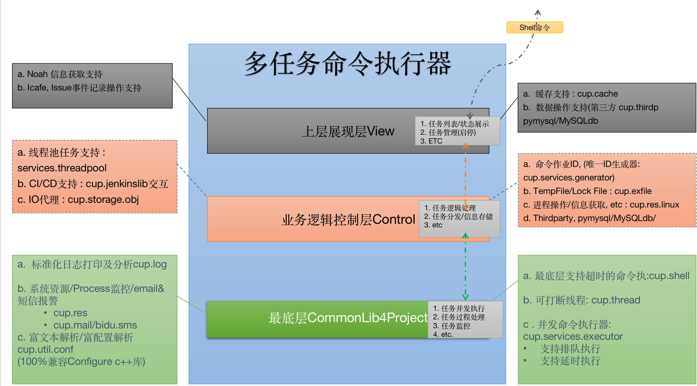
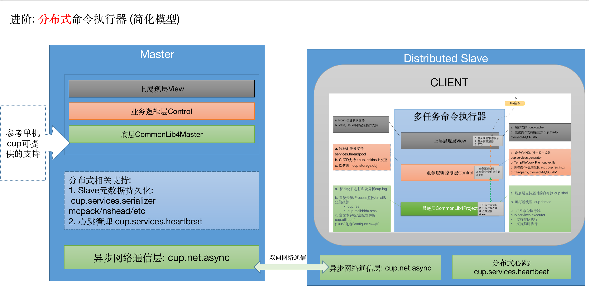
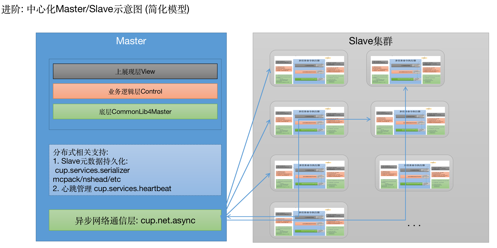

# 1. 使用Cup快速构建Python Service

<!-- MDTOC maxdepth:6 firsth1:1 numbering:0 flatten:0 bullets:1 updateOnSave:1 -->

- [使用Cup快速构建Python Service](#使用Cup快速构建Python-Service)   
   - [1.1 快速了解](#11-快速了解)   
   - [1.2 快速构建命令执行器示例](#12-快速构建命令执行器示例)   
   - [1.3 快速构建分布式化命令执行器](#13-快速构建分布式化命令执行器)   

<!-- /MDTOC -->

在这篇文章里, 你能学习到:
- 如何利用CUP快速构建一个Python Serivce
- CUP在构建单机Service方面能提供哪些优质feature
- CUP在构建单机Service基础上, 再构建分布式Service能提供哪些优质feature

在使用 CUP 构建 Service 前, 请先花点时间浏览当前 CUP 可以为你提供哪些基础的 baseService 服务.
## 1.1 快速了解
在CUP现有文档中推荐你先**快速浏览**如下内容, 心中有个**大概印象**:
- 当前常用的util类场景
  - [常用lib库支持场景](CommonUserSenario.md)
- 当前常用的baseService
  - [Cup Service篇](CommonService.md).

## 1.2 快速构建命令执行器示例

如果我们把单机命令执行器简化为一个三层结构的逻辑处理程序:
- View层处理展现及任务接收
- Control逻辑控制层负责任务模型拆解、调度、信息存储等逻辑处理
- CommonLib最底层负责最终的任务执行、日志记录、监控和反馈

相应在每一层中cup可以支持的Features如图所示.

## 1.3 快速构建分布式化命令执行器

进阶版, 如果你想将单机的一个命令执行器引擎分布式化, 进而实现一个:
- 接受跨机执行任务
- 支持分布式并行调度
- 支持任务监控及过程管理
- 支持任务报警&监控

可以在CUP的帮助下, 完成一个分布式命令执行器服务:
- Master为管理Distributed Slave的中心控制节点
- Slave为每台机器上启动的处理单元, 可以看做一个`1.2`中提及的单机版执行器
- 通过网络通信 & 分布式化处理, 进而达到接受单机/多机/并行等任务的分布式命令执行器

中心化的Master可以管理整个Slave集群:

## 1.4 网络通信
如果你对上文中 **`cup.net.async`** 是如何支持网络通信&内部通信逻辑感兴趣, 欢迎移步:
[异步网络通信协议](AsyncNet.md)
